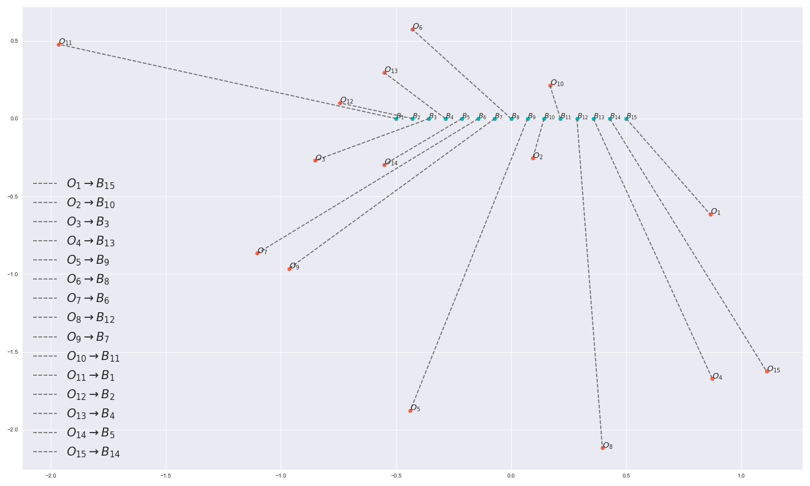
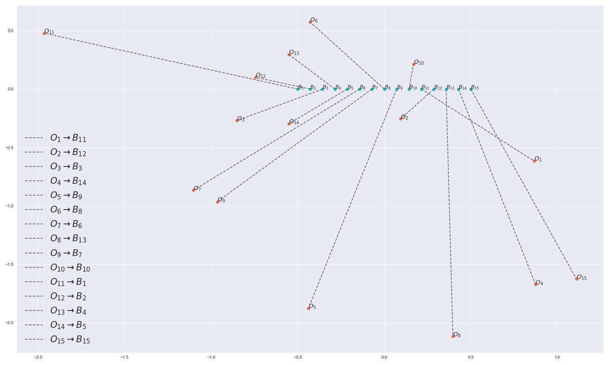
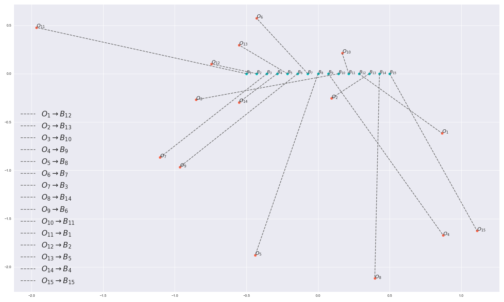
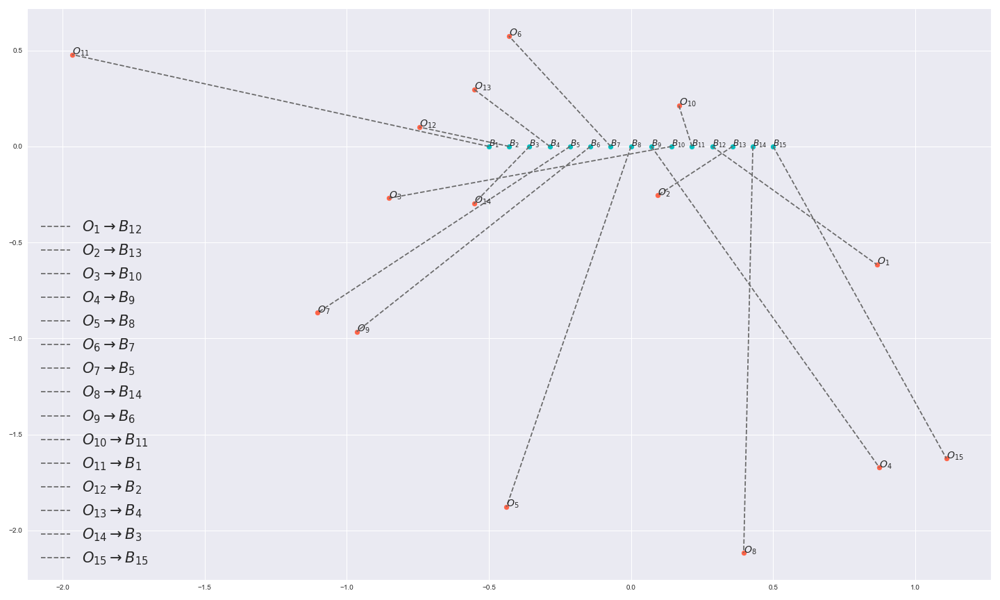
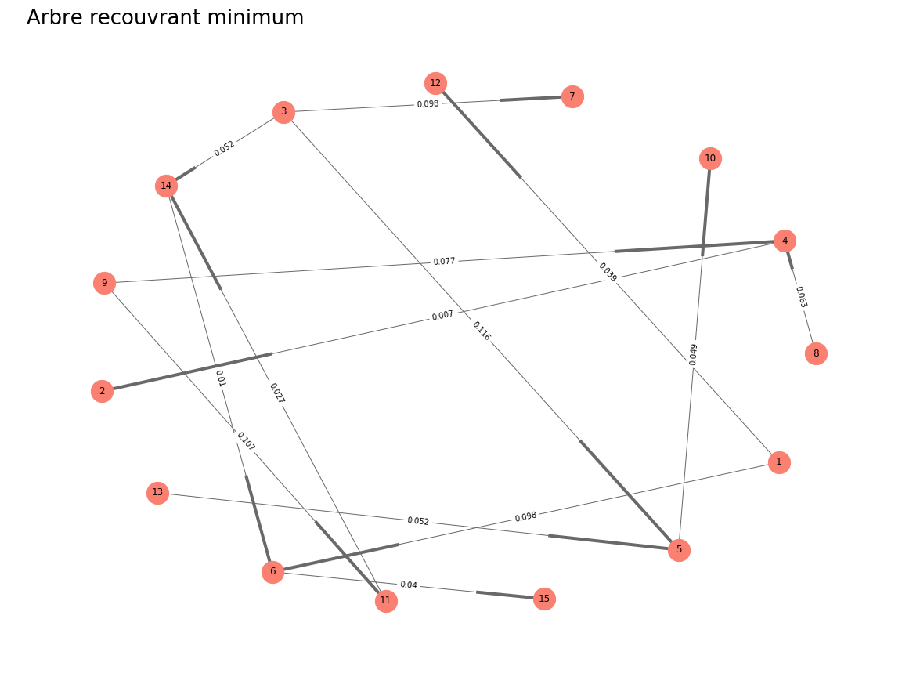
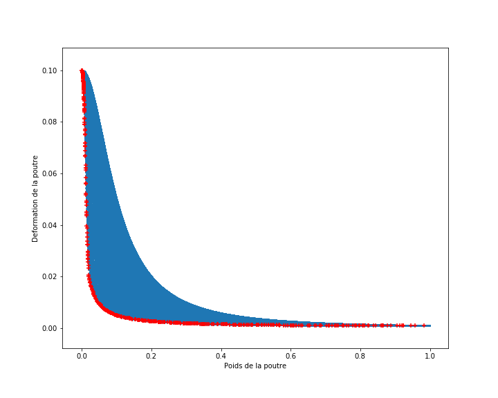
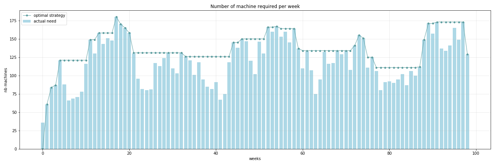

# Continuous and Discrete Optimization
OMA Labs 2018-2019

### Table of contents:
+ **[1. Optimisation continue et optimisation approchée](#1-partie1)**
+ **[2. Optimisation discrète et optimisation multiobjectif](#2-partie2&3)**

# 1. Optimisation continue et optimisation approchée
## 1.1. Optimisation sans contraintes
### 1.1.1. Méthode du gradient

__a)__

__b)__

__c)__

### 1.1.2. Méthode BFGS

## 1.2. Optimisation sous contraintes
### 1.2.1. Optimisation à l'aide de routines
### 1.2.2. Optimisation sous contraintes et pénalisation

__1)__

__2)__
### 1.2.3. Méthodes duales pour l'optimisation sous contraintes

__1)__

__2)__

## 1.3. Optimisation non convexe - Recuit simulé

__a)__

__b)__

__c)__

## 1.4. Application à la synthèse à réponse impulsionnelle infinie

---

# 2. Optimisation discrète et optimisation multiobjectif

## 2.1. Rangement d'objets

__1) Comment traduire mathématiquement que la boîte  contient
un objet et un seul et que l’objet  se trouve dans une boîte et une seule ?__

On note  la relation _"l'objet  est dans la boite "_

Alors,

Et de même,

__2) Formulation du PLNE et mise en oeuvre de sa résolution__

Le problème de programmation linéaire en nombre entiers s’écrit :

_Résultat : 15.3776_

__3) Objet 1 à gauche directe de l'Objet 2__

On formule cette nouvelle contrainte par :

De plus, cette contrainte impose également que la relation  est impossible car  ne peut alors être droite de .

On impose donc  (il s'ensuit par les contraintes précédentes que )

_Résultat : 15.5651_

__4) Objet 3 à droite de l'Objet 4__

Montrons que  à droite de 

> Raisonnons par l'absurde et supposons  à gauche de 

> Notons  l'indice de la boite contenant .
> Alors, la boite contenant  étant à droite de , 

>  et 

>  ce qui est impossible

> Notons  l'indice de la boite contenant 

> Comme  à gauche de , 

> 

On remarque que cette contrainte peut se réécrire de façon plus succinte selon :

En effet, pour un  donné, si  et que  à droite de , alors toutes les boites d'indice supérieur ne peuvent contenir , c'est à dire .

Cette contrainte englobe également les cas limite :

- Si ,  ne peut être dans  aussi selon les contraintes précédentes et la nouvelle contrainte lui interdit d'être à droite de , c'est donc un cas impossible

- So ,  ne peut être dans  aussi selon les contraintes précédentes et est donc nécessairement à gauche de 

_Résultat : 15.9014_

__5) Objet 7 à côté de l'Objet 9__

Il suffit ici de symétriser la contrainte énoncée à la question 3 pour autoriser d'être à droite ou à gauche

Le problème d'optimisation n'est alors plus linéaire.

Une façon de contourner ce problème consiste à résoudre le problème en imposant  à gauche de , puis celui imposant  à droite de , et de garder la solution minimisant la distance totale

_Résultat : 15.9048_

__6) Unicité de la solution__

On remarque que les objets 13 et 14 sont symétriques par rapport à l'axe des abscisses. Donc en principe, échanger leurs attributions mutuelles ne devrait pas impacter la distance.

En imposant la contrainte  on retrouve la meme distance que précédemment, il n'y a donc pas unicité de la solution. -->

## 2.2. Communication entre espions

__1) Modélisation du problème et démarche de résolution__

On pose  l'ensemble des espions et  les voies de communications entre les espions.

L'objectif étant de minimiser la probabilité d'interception, on peut réexprimer le problème comme la maximisation de la probabilité de non-interception.

Notons interception de la commmunication entre  et , alors:

En pondérant les arrêtes de notre graphe par l'application symétrique , le problème revient alors à résoudre un problème d'arbre recouvrant minimum sur ,

Des algorithmes polynomiaux de type Kruskal et Prim permettent de résoudre le problème de façon exacte.

__2) Résultat__

La probabilité d'interception est donnée par :

Où  est la solution obtenu par l'algorithme de Kruskal

On obtient 

## 2.3 Dimensionnement d'une poutre

__1) Méthode gloutonne__

Dans ce problème, il sera question d'optimisation multi-objectif puisque l'on cherche à minimiser à la fois le poids et la deflexion de la poutre sous certaines contraintes.

Les fonctions qui donnent le poids et la deflexion de la poutre, étant faciles à évaluer, nous pouvons utiliser la méthode gloutonne (gourmande) dans laquelle il sera question de générer 100000 points qui réalisent les contraintes physiques imposées et de tracer un front de Pareto.

La recherche des points Pareto Optimales se fait en 2 étapes:

- Pour chaque point généré, on stocke sous forme de liste l'ensemble des points situés en bas et à gauche de lui (ayant un poids et une deflexion inférieurs à lui)

- Si cette liste est vide, alors ce point est pareto-optimal. Dans le cas contraire, ce point n'est pas retenu

_Résultat : 13.7482 s_

__2) Méthode plus sophistiquée__

On transforme ici notre problème en problème mono-objectif:

On fait varier  sur un intervalle afin de donner à chaque itération plus de poids à l'une des 2 fonctions que l'on cherche à minimiser et on résout plusieurs fois le problème de minimisation précédent.

On notera que le problème de minimisation sous contraintes se fera en utilisant une méthode de type quasi Newton (SLSQP) dans laquelle on définira des bornes et des contraintes. Aussi, comme les solutions obtenus dépendent de notre point d'initialisation, on définira à chaque itération un x0 différent que l'on générera de manière random.

_Résultat : 2.4975 s_

__Comparaison__ :

Qualité de l'estimation: [Méthode Gloutonne : Très bonne estimation, Méthode Sophistiquée: Bonne estimation]

Nombre d'évaluations des objectifs: [Méthode Gloutonne: 200000, Méthode Sophistiquée: 10000]

Temps d'éxecution: [Méthode Gloutonne améliorée: 13.7s, Méthode Sophistiquée: 2.5s]

## 2.4 Approvisionnement d'un chantier

__1) Modélisation du problème__

Notons  et  les vecteurs designant respectivement le nombre de machine à ajouter et retirer au temps .

Chaque semaine, l'entreprise paye donc  de frais de mise en service et  de frais de restitution.

De plus, en prenant la somme sur les semaines passées des ajouts moins les retraits, on obtient le nombre de machines actuellement louées. On en déduit que l'entreprise paye également chaque semaine  de frais de location.

On peut ainsi définir une fonction de frais dépensé sur la durée du chantier par :

De plus, on doit vérifier les contraintes suivantes :

- Aucun retour de machine possible la première semaine 
- Le nombre de machine louée sur une semaine donnée doit toujours être supérieur au nombre de machines requises 
- Tout est rendu et rien n'est ajouté lors de la dernière semaine 

Finalement, les vecteurs  et  étant des vecteurs entiers de , en notant , on peut poser le problème comme le problème de programmation linéaire en nombre entier suivant :

__2) Résultat__

_Coût optimal = 3304000_

__3) Commentaires__

On remarque que . Ainsi, en terme de coût, les 2 process suivants sont équivalents :

On en déduit qu'une stratégie optimale intuitive consiste à ne conserver une machine que si sa durée de location n'excède pas 10 semaines, autrement il est plus intéressant de la restituer pour la relouer après.

Cette stratégie est cohérente avec la stratégie optimale observée entre les semaines 77 et 87 durant lesquelles le nombre de machines louées est supérieur au besoin car il coûterait plus cher de les restituer pour les relouer en vue de la semaine 87
